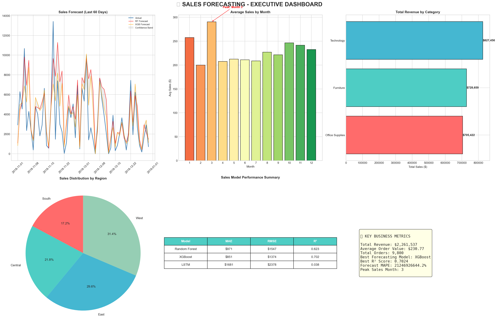
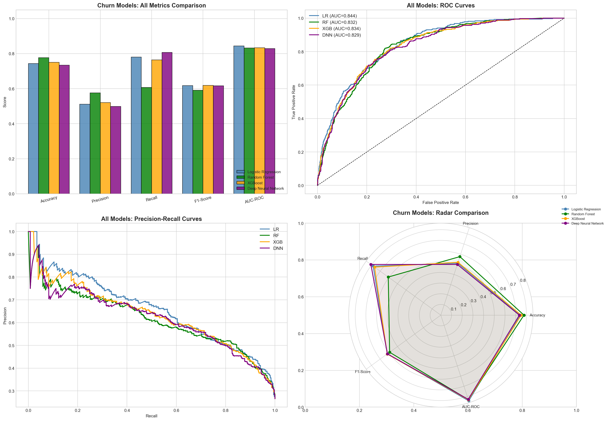

# 🚀 AI-Driven Predictive Analytics for Business Automation

[](https://www.python.org/)
[](https://xgboost.readthedocs.io/)
[](https://www.tensorflow.org/)

This repository features a comprehensive AI suite designed to automate and optimize business decision-making through advanced predictive analytics. It implements end-to-end machine learning pipelines for two high-impact business use cases.

---

## 📊 Modules

### 1. Sales Forecasting Engine
Predicts future sales performance using historical data, seasonal trends, and customer behavior patterns.
- **Models:** Random Forest, XGBoost, Gradient Boosting, LSTM (Deep Learning).
- **Features:** Time-series analysis, seasonality detection, and category-wise forecasting.
- **Outcome:** Executive dashboards for revenue planning and inventory optimization.

### 2. Customer Churn Prediction
Identifies at-risk customers with high precision to help businesses proactively improve retention.
- **Models:** Logistic Regression, Random Forest, XGBoost, Deep Neural Networks (DNN).
- **Techniques:** SMOTE for imbalanced data, Permutation Importance, ROC-AUC/PR-Curve optimization.
- **Outcome:** Risk segmentation dashboards for marketing and customer success teams.

---

## 🛠️ Tech Stack

- **Data Analysis:** `Pandas`, `NumPy`
- **Visualization:** `Matplotlib`, `Seaborn`, `Plotly` (Interactive)
- **Machine Learning:** `Scikit-learn`, `XGBoost`, `LightGBM`
- **Deep Learning:** `TensorFlow`, `Keras`

---

## 📁 Project Structure

```text
├── charts/                   # Generated executive-level dashboards and plots
├── churn_data.csv            # Customer churn dataset
├── sales_data.csv            # Historical sales dataset
├── AI_Predictive_Analytics.ipynb # Main project notebook
├── requirements.txt          # Python dependencies
└── README.md                 # Project documentation
```

---

## 🚀 Getting Started

1. **Clone the repository:**
   ```bash
   git clone https://github.com/your-username/AI-Business-Automation.git
   ```

2. **Install dependencies:**
   ```bash
   pip install -r requirements.txt
   ```

3. **Run the analysis:**
   Open `AI_Predictive_Analytics.ipynb` in Jupyter Lab or VS Code and run all cells.

---

## 📈 Executive Dashboards

The AI suite generates high-impact visual reports for executive decision-making.

### Sales Forecasting Dashboard

*Highlights: Monthly revenue trends, Region-wise distribution, and Forecast confidence bands.*

### Customer Churn Comparison

*Highlights: Multi-model performance metrics (F1, Accuracy, AUC) and Risk segmentation.*

---

## 👨‍💻 Author
**Iffat Nazir**
*AI & Data Science Specialist*

---
*Note: This project was developed as part of a professional portfolio for business automation solutions.*
